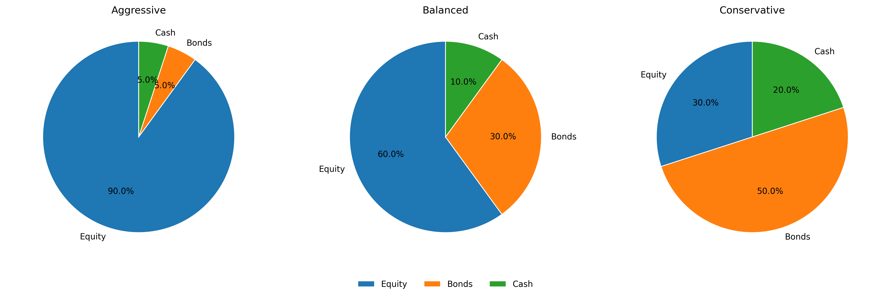
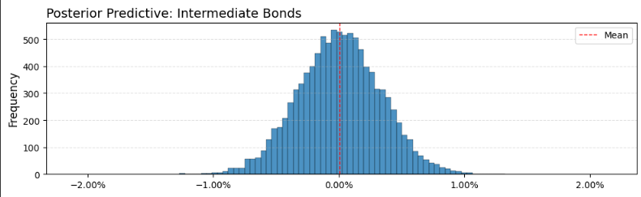
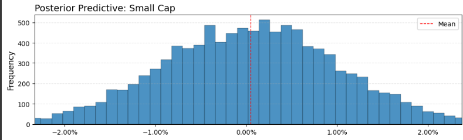
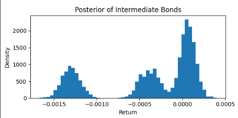
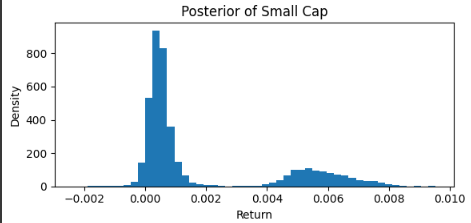
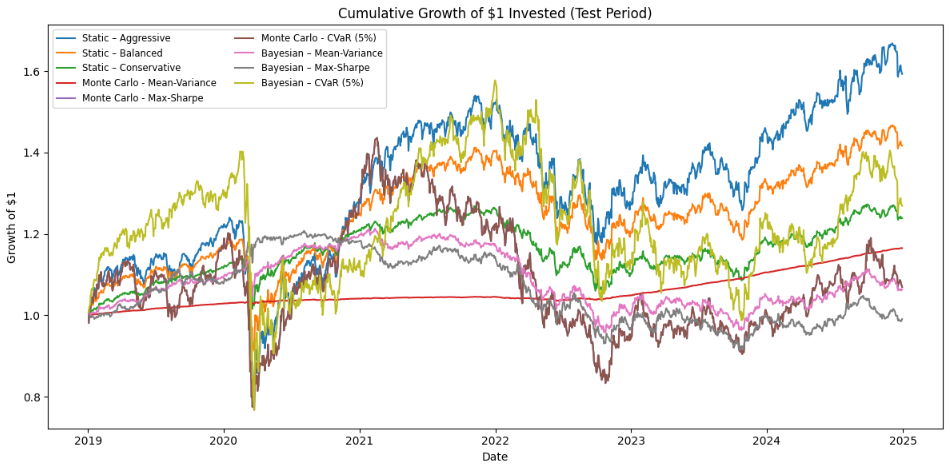

  

# Data

**Source:** Yahoo Finance API

| **Phase**         | **Period**                  | **Duration** |
|-------------------|-----------------------------|--------------|
| Data History      | 08/01/2007 – 12/31/2024     | 12 years     |
| Model Training    | 08/01/2007 – 12/31/2018     | 6 years      |
| Model Testing     | 01/01/2019 – 12/31/2024     | 6 years      |

**Limitations:** 
- Limited data availability prior to 2010
- Extended history needs to be analyzed to model different market cycles

#### Asset Classes

| **Asset Class**             | **Benchmark Index**                          | **ETF Name**                                       | **Ticker** |
|:----------------------------|:---------------------------------------------|:---------------------------------------------------|:----------:|
| **Large Cap**               | S&P 500 Index                                 | iShares Core S&P 500 ETF                           | `IVV`      |
| **Mid Cap**                 | S&P MidCap 400 Index                          | iShares S&P MidCap 400 ETF                         | `IJH`      |
| **Small Cap**               | S&P SmallCap 600 Index                        | iShares S&P SmallCap 600 ETF                       | `IJR`      |
| **Intl. Dev. Equities**     | MSCI EAFE Index                               | Vanguard FTSE Developed Markets ETF                | `VEA`      |
| **Emerging Market Equities**| MSCI Emerging Markets Index                  | Vanguard FTSE Emerging Markets ETF                 | `VWO`      |
| **Intermediate Bonds**      | Bloomberg U.S. Aggregate Bond Index           | Vanguard Total Bond Market ETF                     | `BND`      |
| **T-Bills**                 | ICE BofA 3-Month U.S. Treasury Bill Index     | SPDR Bloomberg 1–3 Month T-Bill ETF                | `BIL`      |
| **REITs**                   | FTSE Nareit All Equity REITs Index           | Vanguard Real Estate ETF                           | `VNQ`      |
| **Commodities**             | S&P GSCI Total Return Index                   | iShares S&P GSCI Commodity-Indexed Trust           | `GSG`      |

The asset classes above represent the major public markets, helping effectively model public markets while minimizing model dimensionality. 

#### Asset Class Grouping

| **Asset Class**            | **Group Index** | **Group Name**           |
|----------------------------|-----------------|--------------------------|
| **Large Cap**              | 0               | Domestic Equity          |
| **Mid Cap**                | 0               | Domestic Equity          |
| **Small Cap**              | 0               | Domestic Equity          |
| **Intl Dev Equity**        | 1               | International Equity     |
| **Emerging Market Equity** | 1               | International Equity     |
| **Intermediate Bonds**     | 2               | Fixed Income             |
| **T-Bill**                 | 2               | Fixed Income             |
| **REIT**                   | 3               | Alternatives             |
| **Commodities**            | 3               | Alternatives             |

##### Why group asset classes? 
- Assets within the same category (e.g. all domestic equities) often share similar risk‐return characteristics.
- Partial pooling of means: Instead of giving each asset its own independent prior, a group-level mean can be introduced. Enables portfolio optimization using the invesment type categories.  

### Data Treatment

Autocorrelation: 
- Ljung box test used to test autocorrelation for each asset class. AR orders assigned, to each asset class, based on the test results, to address the serial correlation. Adjusted MU calculated based on these AR ordes. 
- Range Index used instead of time index to treat for data being unavailable on weekends and trading holidays.
-   

| Ticker                 | Adj-mu    |
|------------------------|-----------|
| Commodities            | -0.000186 |
| Emerging Market Equity | -0.001030 |
| Intermediate Bonds     |  0.000183 |
| Mid Cap                |  0.000337 |
| Small Cap              | -0.000010 |
| Large Cap              | -0.000122 |
| T-Bill                 | -0.000044 |
| Intl Dev Equity        | -0.000546 |
| REIT                   | -0.000376 |

# Optimization Functions

#### Output: Asset Class Investment Allocation Weights
These weights will be used to construct portfolios and test the performance of all the portfolios. 

### 1. Mean Variance Optimization 

$$
w \;\propto\; \Sigma^{-1}\,(\mu - r_f \,\mathbf{1})
$$

Subject to

$$
w_i \ge 0,
\qquad
\sum_{i=1}^n w_i = 1.
$$

How it works: 

- Takes point estimates of expected returns (μ) and the covariance matrix (Σ), computes excess returns over a risk-free rate, then finds weights w ∝ Σ⁻¹(μ – rₙ).
- Clips negative weights to zero (no shorting) and normalizes so that weights sum to one.
- Allocates more to assets with high expected return relative to their contribution to overall volatility.

### 2. Maximum Sharpe‐Ratio

$$
\mathrm{Sharpe}(w)
= \frac{w^\top \mu - r_f}{\sqrt{w^\top \Sigma\,w}}
$$

Maximize Sharpe\,(w) subject to

$$
w_i \ge 0,
\qquad
\sum_{i=1}^n w_i = 1.
$$

How it works: 

- Solves a constrained optimization to maximize Sharpe ratio.
- Chooses the portfolio on the efficient frontier that gives the highest reward per unit of risk

### 3. Minimum CVaR Portfolio (at level α)

**Portfolio return for scenario (s):**

$$
R_p^{(s)} := \sum_{i=1}^n w_i\,r_i^{(s)}, \quad s = 1,2,\dots,S.
$$

$$
\begin{aligned}
\min_{\mathbf{w},\,\eta}\quad
& \eta \;+\; \frac{1}{S\,(1-\alpha)} \sum_{s=1}^S \max\{-R_p^{(s)} - \eta,\,0\},\\
\text{s.t.}\quad
& \sum_{i=1}^n w_i = 1,\\
& 0 \le w_i \le 1,\quad \forall i.
\end{aligned}
$$

where
- $S$ is the number of simulated scenarios,
- $r_s \in \mathbb{R}^N$ are the asset returns in scenario $s$,
- $\zeta$ is the VaR (i.e.\ the $\alpha$-quantile loss),
- $\alpha \in (0,1)$ is the tail probability.

How it works: 

- Given a matrix of simulated returns (shape = sims × assets), defines portfolio return in each simulation and computes the Conditional Value at Risk (average of worst α-percentile losses)
- Directly targets tail-risk: ensures that, in the worst α*100% of scenarios, the average loss is as small as possible

# Investment Portfolio Generator Models

## 1. Static-Weights Portfolios 

**Morningstar’s Target Allocation Index** used to determine the static portfolios:  

- **Aggressive**: 90% equity, 5% bonds, 5% cash
- **Balanced**: 60% equity, 30% bonds, 10% cash
- **Conservative**: 30% equity, 50% bonds, 20% cash

  

#### Portfolio Allocation

| **Asset Class**            | **Aggressive** | **Balanced** | **Conservative** |
|----------------------------|:--------------:|:------------:|:----------------:|
| **Large Cap**              |      20%       |     15%      |       10%        |
| **Mid Cap**                |      20%       |     10%      |        5%        |
| **Small Cap**              |      15%       |     10%      |        5%        |
| **Intl. Dev Equity**       |      15%       |     10%      |        5%        |
| **Emerging Market Equity** |      10%       |      5%      |        3%        |
| **REIT**                   |       5%       |      5%      |        1%        |
| **Commodities**            |       5%       |      5%      |        1%        |
| **Intermediate Bonds**     |       5%       |     30%      |       50%        |
| **T-Bill**                 |       5%       |     10%      |       20%        |

## 2. Monte Carlo Sampling & Distribution Metric Portfolios

**Model Details:** 
- MC simulations: 10 000 draws

- Risk‐free rate (for MC and MV): default 0% (set to 1% in model)
- Hierarchical/Multivariate Models: Used to map the relationship between the different asset classes, while minimizing overfitting.

How it works:
- Estimate μ and Σ from historical returns.
- Simulate thousands of return scenarios from 𝒩(μ,Σ).
- Compute distribution metrics (mean, cov, VaR, CVaR).
- Apply each of the three optimizers (mean-variance, max-Sharpe, min-CVaR) to those metrics.
- By simulating, you capture how random fluctuations might play out and build portfolios based on the full distribution—not just point estimates.

#### Parameter Estimation

$$
\hat\mu = \frac{1}{T}\sum_{t=1}^T R_t,
\quad
\hat\Sigma = \frac{1}{T-1}\sum_{t=1}^T (R_t - \hat\mu)(R_t - \hat\mu)^\top.
$$

#### Simulation

$$
R^{(s)} \;\sim\; \mathcal{N}\bigl(\hat\mu,\;\hat\Sigma\bigr),
\quad
s=1,\dots,S.
$$

#### Metrics

$$
\mu_i^{(\mathrm{sim})}
\;=\;\frac{1}{S}\sum_{s=1}^S R_i^{(s)},
\quad
\Sigma_{ij}^{(\mathrm{sim})}
\;=\;\frac{1}{S-1}\sum_{s=1}^S
\bigl(R_i^{(s)} - \mu_i^{(\mathrm{sim})}\bigr)
\bigl(R_j^{(s)} - \mu_j^{(\mathrm{sim})}\bigr).
$$

where

- $S$ is the total number of Monte Carlo samples.  
- $\mathbf{r}_s = \bigl(r_{1,s},\dots,r_{N,s}\bigr)^\top$ is the vector of simulated returns in iteration $s$.  
- $\mu_i^{(\mathrm{sim})}$ is the average simulated return of asset $i$.  
- $\Sigma_{i,j}^{(\mathrm{sim})}$ is the sample covariance between assets $i$ and $j$.  

#### Asset Class Mapping Distributions

##### Intermediate Bonds (Monte Carlo)

##### Small Cap (Monte Carlo)

#### Model Weights 

| **Asset Class**             | **Mean-Variance** | **Max-Sharpe** | **CVaR (5%)** |
|-----------------------------|------------------:|---------------:|--------------:|
| **Commodities**             |             0.00% |          0.00% |         0.00% |
| **Emerging Market Equity**  |             0.00% |          0.00% |       100.00% |
| **Intermediate Bonds**      |             0.57% |          0.31% |         0.00% |
| **Mid Cap**                 |             0.00% |          0.00% |         0.00% |
| **Small Cap**               |             0.91% |          0.15% |         0.00% |
| **Large Cap**               |             1.66% |          0.48% |         0.00% |
| **T-Bill**                  |            96.72% |         99.06% |         0.00% |
| **Intl Dev Equity**         |             0.13% |          0.00% |         0.00% |
| **REIT**                    |             0.00% |          0.00% |         0.00% |

## 3. Bayesian Hierarchical MCMC Model (PyMC)

**Model Details:**
- MCMC sampling: 4 chains; 1 000 tune + 3 000 draws; target_accept = 0.95

- Risk‐free rate (for MC and MV): default 0% (set to 1% in model)
- Hierarchical/Multivariate Models: Used to map the relationship between the different asset classes, while minimizing overfitting.
- Student-t distribution used instead of normal distribution to better model the more frequent outlier events.
- A weakly-informative prior added on degrees of freedom, which robustifies the model without impacting the correlation or hierarchical model

How it works: 

- Specify priors:
  - μₐ ~ Normal(0,0.1) for each asset a
  - Σ via an LKJ-Cholesky prior for correlations and Half-Normal priors for marginal SDs
- Observe historical returns as a multivariate normal (with the Cholesky factor).
- Sample the joint posterior of (μ,Σ) using PyMC.
- Summarize the posterior: extract posterior means of μ and empirical covariance of all μ-draws.
- Plug into the three optimizer functions to get final weights.
- Fully accounts for uncertainty in  estimates—if data are noisy or scarce. Posterior spreads will be wider, leading to more conservative allocations.

#### Priors

$$
\mu_i \sim \mathcal{N}\bigl(0,\;0.1^2\bigr), 
\quad i = 1, \dots, n.
$$

$$
L \sim \mathrm{LKJCholeskyCov}\bigl(\eta,\;\mathrm{sd\_dist}\bigr),
\quad
\Sigma = L\,L^\top.
$$

**LKJ–Cholesky:**  
Rather than sampling a full correlation matrix directly, we sample its Cholesky factor **L** from the LKJ distribution. This ensures positive-definiteness and efficient sampling in PyMC/PyMC3
    

#### Likelihood

$$
R_t \sim \mathcal{N}\bigl(\mu,\;\Sigma\bigr),
\quad t = 1, \dots, T.
$$

#### Posterior

$$
p\bigl(\mu,\Sigma \mid R_{1:T}\bigr)
\;\propto\;
\Biggl[\prod_{t=1}^T \mathcal{N}\bigl(R_t \mid \mu,\Sigma\bigr)\Biggr]
\;\times\;
\mathcal{N}\bigl(\mu \mid 0,\,0.1^2\bigr)
\;\times\;
\mathrm{LKJ}\bigl(\Sigma \mid \eta\bigr).
$$

#### Asset Class Mapping Distributions

#### Intermediate Bonds (MCMC)

#### Small Cap (MCMC)

### Enhancement - Investor Views 

#### Investor Tilt (η) Interpretation
 

The investor‐tilt parameter **η** controls how strongly we believe correlations should be shrunk toward zero in the LKJ prior.

| **η** | **Interpretation**                                             | **Effect on Off-Diagonal Correlations**               |
|:-----:|:---------------------------------------------------------------|:-----------------------------------------------------|
| 1     | “I have no strong belief about correlations” (flat)            | No shrinkage (uniform over valid correlation matrices) |
| 2     | Mild shrinkage toward zero correlation                         | Moderate pull of off-diagonals toward zero           |
| ≥ 4   | Strong shrinkage: most off-diagonals will be near zero         | Heavy penalization of nonzero correlations           |

---

#### Asset-Class Specific Tilt Values

Apply the following η values to your tilt vector. Asset classes not listed are left un-tilted (η = 0).

| **Asset Class**         | **η (Tilt)** |
|:------------------------|:-------------|
| Large Cap               | 2            |
| Commodities             | 1            |
| *All others*            | 0            |

#### Model Weights 

| **Asset Class**            | **Mean-Variance** | **Max-Sharpe** | **CVaR (5%)** |
|----------------------------|------------------:|---------------:|--------------:|
| **Commodities**            |             0.00% |          0.00% |         0.00% |
| **Emerging Market Equity** |            14.93% |          0.00% |         0.00% |
| **Intermediate Bonds**     |            69.68% |         99.07% |         0.00% |
| **Mid Cap**                |             0.00% |          0.00% |         0.00% |
| **Small Cap**              |             4.08% |          0.00% |         0.00% |
| **Large Cap**              |             0.00% |          0.00% |         0.00% |
| **T-Bill**                 |            11.21% |          0.00% |         0.00% |
| **Intl Dev Equity**        |             0.10% |          0.93% |         0.00% |
| **REIT**                   |             0.00% |          0.00% |       100.00% |

# Results 

Log Returns used to evalaute portfolio performance because:
- Factors in compunding and multi-period aggregation
- Symmmetry for gains and losses AKA gains and losses don't cancel each other out
- Helps capture small changes as compunding is captured over time   

$$
r_t = \ln\!\Bigl(\frac{P_t}{P_{t-1}}\Bigr)
$$

#### Portfolio Cumulative Returns (01/01/2019 - 12/31/2024)

#### Yearly Returns

| **Year** | **Static Aggressive** | **Static Balanced** | **Static Conservative** | **MC Mean-Variance** | **MC Max-Sharpe** | **MC CVaR (5%)** | **Bayes Mean-Variance** | **Bayes Max-Sharpe** | **Bayes CVaR (5%)** |
|:--------:|----------------------:|--------------------:|------------------------:|--------------------:|------------------:|-----------------:|------------------------:|---------------------:|---------------------:|
| **2020** |                5.47%  |              7.17%  |                 8.50%   |             1.19%  |           10.11%  |          10.11%  |                 9.78%   |               9.74%  |             −13.26%  |
| **2021** |               18.24%  |             12.03%  |                 4.21%   |             0.41%  |           −5.16%  |          −5.16%  |                −2.03%   |              −3.33%  |              38.99%  |
| **2022** |              −16.18%  |            −14.30%  |               −12.80%   |             0.35%  |          −22.72%  |         −22.72%  |               −14.71%   |             −15.59%  |             −28.47%  |
| **2023** |               14.04%  |             10.52%  |                 7.83%   |             5.40%  |            7.67%  |           7.67%  |                 4.78%   |               3.32%  |               9.64%  |
| **2024** |                9.72%  |              6.66%  |                 4.43%   |             5.37%  |            5.58%  |           5.58%  |                 1.40%   |              −0.64%  |               2.57%  |

#### Full-Period Cumulative Returns

| **Portfolio**                    | **Cumulative Return** |
|:---------------------------------|----------------------:|
| Static – Aggressive              |                59.28% |
| Static – Balanced                |                41.64% |
| Static – Conservative            |                23.89% |
| Monte Carlo – Mean-Variance      |                16.51% |
| Monte Carlo – Max-Sharpe         |                 6.95% |
| Monte Carlo – CVaR (5%)          |                 6.95% |
| Bayesian – Mean-Variance         |                 6.35% |
| Bayesian – Max-Sharpe            |                −0.92% |
| Bayesian – CVaR (5%)             |                26.87% |

# Takeaways and Future Enhancements

## Model Operationalization

The following updates need to be made to operatioanlize the model: 

Bayesian model: 
- Run teststo check the tails of each asset class. Adjust the priors accordingly to treat for the fatness of the tails. Set up a more robust autoamted way to test for fatness of tails. This should be part of model monitoring. 

#### Data Modelling:
- Longer data history needed to model different market cycles
  - Limited data history for some investment securities

- Posteriors obtained from recent data history led to higher portfolio performance.
  - Explore decay functions to place more importance on recent data   
  
#### Portfolio Construction Engine: 
- The Bayesian Portfolio Construction Engines output asset class weights. The asset class weights can be incorporatedas as another input in the Portfolio Construction Engine, and the weights be determined by a posterior to automate the portfolio rebalancing.
  
#### Guardrails - Portfolio Construction Engine: 

- Asset Allocation Limits: Maximum and minimum limits asset allocation Limits.
- Asset Allocation Target Deviation Threshold: Specify threshold for trigerring a rebalance e.g. 3% overall deviation from asset class targets.
- New Portfolio Allocation Guardrails: Factor prior portfolio allocation and implement a penalty function for deviating from prior asset classes. Penalize large asset allocation shifts to minimize large turnover. 

##### Author: Sami Naeem

